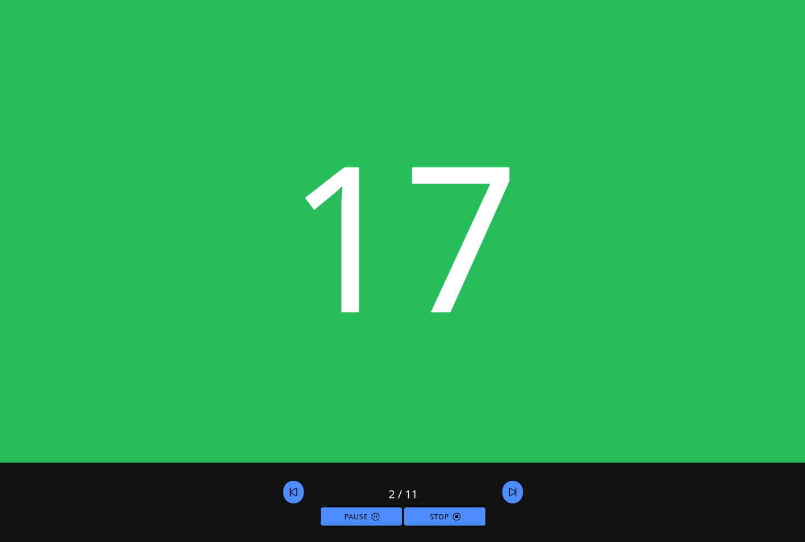
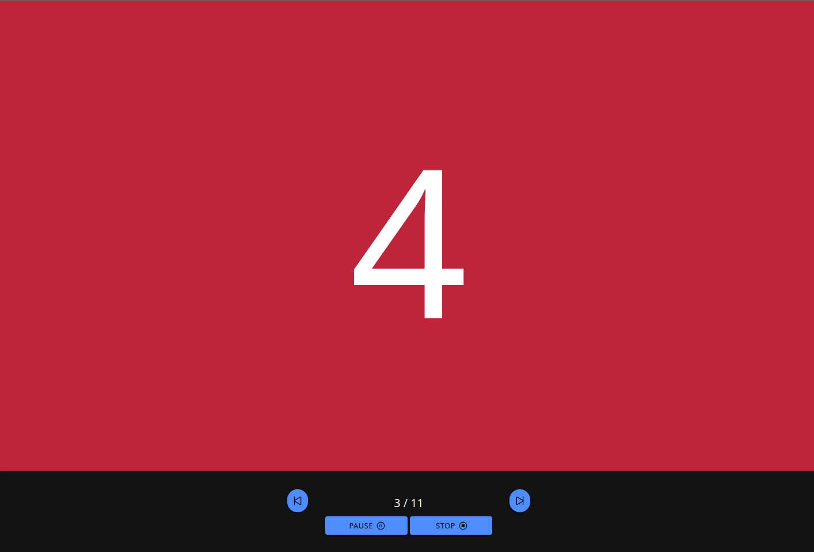

# Timer App

Ionic + React application to easily set a looped timer, with active + break independently.

1. Set how many iterations, **rounds** you want to go
2. Set the duration (in seconds) of the **active** part of the round
3. Set the duration (in seconds) of the **break** part of the round
4. Hit START

On the bottom there are controls.<br>
Rounds can be skipped, reset or go back to a previous round (double tap on back button)

## Configuration
For trying out the repo, the web app can be run locally with
```bash
$ ionic serve
```

After setting some capacitor ([documentation here](https://capacitorjs.com/docs/)) you can try the mobile app, for example for android:
```bash
$ npx cap run android
```

---
### Screenshots
<table>
  <tr>
    <td>Config menu</td>
    <td>Active part</td>
    <td>Break part</td>
  </tr>
  <tr>
    <td></td>
    <td></td>
    <td></td>
  </tr>
 </table>
<table>
  <tr>
    <td></td>
    <td></td>
  </tr>
 </table>
